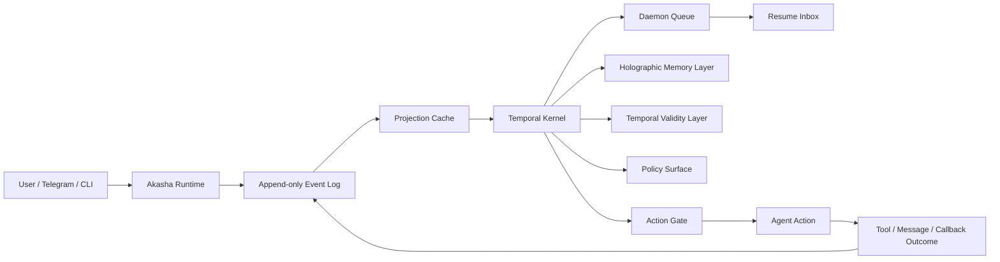

# Akasha

Akasha is an experimental Temporal Agent.

It uses time as the form of experience: ordering memory, action, responsibility, and change.

Akasha is local-first, inspectable, and designed for continuous use.

## Why Akasha Exists

Most coding agents still behave like request-response tools:

- They see a bounded context window, not a continuous history.
- They remember snippets, but often lose ordering, causality, and responsibility.
- They can say "I will do this later", but that future responsibility is rarely a first-class object.
- They can recall old facts, but often fail to ask whether those facts are still current.
- They can repeat mistakes because previous failures are not turned into reusable procedures.

Akasha explores a different model:

```text
experience -> event stream
event stream -> temporal state
temporal state -> action context
action -> outcome
outcome -> memory feedback
```

Time is the substrate. Memory, policy, callbacks, reflection, and gateway messages are all projected from the same append-only history.

## Core Architecture



The normal session transcript still exists. Akasha adds a sidecar time stream and derived projections:

- **Event Log**: immutable JSONL facts for sessions, turns, messages, tools, artifacts, policies, callbacks, gateway updates, state changes, and memory events.
- **Temporal Kernel**: central coordinator for state projection, action context, policy evaluation, daemon passes, callbacks, and memory reconstruction.
- **Action Gate**: hidden pre-action context built from current temporal state, unresolved loops, due callbacks, memory, and stale facts.
- **Holographic Memory Layer**: projects events into distributed traces, reconstructs a memory field from the current cue, and feeds outcomes back into trace weights.
- **Temporal Validity Layer**: separates historical facts from current state. Short-lived states such as health, mood, location, and availability can become stale or expired.
- **Daemon and Resume Inbox**: lets future callbacks return to the agent even when no interactive session is running.
- **Gateway**: keeps Akasha reachable through Telegram while preserving the same event stream and accountability chain.

## What Works Today

Akasha currently includes:

- Interactive coding agent CLI with `read`, `write`, `edit`, `bash`, image input, sessions, branching, compaction, extensions, skills, and themes.
- Project and global settings under `.akasha/settings.json` and `~/.akasha/agent/settings.json`.
- Local append-only Akasha event logs under `~/.akasha/agent/akasha/events/`.
- Projection cache for temporal state, project state, user timeline, and memory traces.
- Action Gate and Temporal Brief injection.
- Explicit time syscalls:
  - `akasha_create_commitment`
  - `akasha_resolve_commitment`
  - `akasha_create_prediction`
  - `akasha_check_prediction`
- Runtime policy profiles for observation, dogfood, strict protocol, and controlled autonomous behavior.
- Callback lifecycle: scheduled, due, claimed, dispatched, completed, cancelled, and failed.
- Resume inbox for pending callback prompts.
- Sleep replay for offline consolidation into lessons, workflows, and procedure candidates.
- Holographic memory traces, cue-driven recall, memory feedback, reconsolidation, and procedure feedback.
- Temporal validity for ephemeral states like health, mood, location, availability, and external-world observations.
- Telegram gateway with long polling, command menu, allowlist, callback delivery, and attachments.

## Quick Start

From a fresh checkout:

```bash
npm install
npm run build
npm install -g ./packages/coding-agent
```

Initialize Akasha for a project:

```bash
akasha init
akasha status
akasha
```

The `akasha` command is the canonical entrypoint.

For source-only development without global install:

```bash
./akasha-test.sh
```

## Daily Commands

Inside an interactive session:

```text
/akasha status
/akasha timeline 30
/akasha action-gate
/akasha task-model
/akasha queue
/akasha why <eventId|toolCallId>
/akasha doctor
```

Outside a session:

```bash
akasha status
akasha daemon status --scope project
akasha daemon tick --scope project
akasha daemon run --scope project --dispatch agent_prompt_file
akasha inbox status
akasha inbox list
akasha inbox run
akasha sleep status --scope project
akasha sleep run --scope project
akasha cache status --scope project
akasha cache rebuild --scope project
```

## Telegram Gateway

Akasha can run as a long-lived Telegram bot while preserving the same Time OS event stream.

Set up the non-secret settings:

```bash
akasha gateway setup
```

Add secrets and routing values to `~/.akasha/agent/.env`:

```bash
TELEGRAM_BOT_TOKEN=...
TELEGRAM_ALLOWED_USERS=123456789
TELEGRAM_HOME_CHAT=123456789
AKASHA_GATEWAY_DEFAULT_CWD=/path/to/workspace
```

Run the gateway:

```bash
akasha gateway status
akasha gateway
```

Common Telegram commands:

```text
/start
/status
/new
/model
/thinking
/stop
/timeline
/setcwd /path/to/workspace
```

The gateway records accepted messages, rejected messages, commands, replies, delivery failures, and callback delivery as `gateway.*` events.

## Temporal Validity

Akasha treats "this happened" and "this is still true" as different claims.

For example, if a user says "my stomach hurts", Akasha can record a historical health-state observation. After the validity window passes, that state becomes stale. It may still be recalled as context, but it should not be treated as current without a currentness check.

This is the purpose of the Temporal Validity Layer:

```text
state.observed -> current -> stale / expired -> confirmed / resolved / superseded
```

The Action Gate can inject stale-state warnings and currentness checks before the model acts on short-lived facts.

## Holographic Memory

Akasha does not model memory as a flat list of notes.

Each event can project into multiple traces:

```text
semantic
artifact
task
goal
tool
failure
success
callback
policy
valence
skill
```

The current situation becomes a cue: user text, cwd, active files, open callbacks, recent failures, policy pressure, stale states, and pending inbox items. Akasha scores traces by resonance, reconstructs a compact memory field, injects it into Action Gate, and records `memory.recalled`.

If the recalled memory helps, it can be reinforced. If it misleads, it can be weakened or reconsolidated. This makes memory a changing projection over time, not a static database.

## Repository Layout

| Package | Description |
| --- | --- |
| [`@earendil-works/akasha-coding-agent`](packages/coding-agent) | Akasha CLI, sessions, tools, Time OS, gateway, and docs |
| [`@earendil-works/akasha-agent-core`](packages/agent) | Agent runtime with tool calling and state management |
| [`@earendil-works/akasha-ai`](packages/ai) | Unified multi-provider LLM API |
| [`@earendil-works/akasha-tui`](packages/tui) | Terminal UI library |
| [`@earendil-works/akasha-web-ui`](packages/web-ui) | Web components for AI chat interfaces |

## Documentation

- [Akasha guide](packages/coding-agent/docs/akasha.md)
- [Settings](packages/coding-agent/docs/settings.md)
- [Sessions](packages/coding-agent/docs/sessions.md)
- [Extensions](packages/coding-agent/docs/extensions.md)
- [Providers](packages/coding-agent/docs/providers.md)
- [Models](packages/coding-agent/docs/models.md)
- [SDK](packages/coding-agent/docs/sdk.md)

## Development

```bash
npm install
npm run build
npm run check
./test.sh
./akasha-test.sh
```

Focused package checks:

```bash
npm --prefix packages/coding-agent run build
npm --prefix packages/coding-agent test -- akasha
```

## Direction

Akasha is guided by a set of practical research questions:

- Can time become the agent's runtime layer?
- Can callbacks and promises become first-class responsibilities?
- Can memory change after recall, action, success, failure, correction, and decay?
- Can the agent distinguish historical memory from current facts?
- Can a local-first agent stay useful from CLI, daemon, and IM entrypoints without hiding its state?

The project intentionally favors readable local files, append-only facts, rebuildable projections, and auditable policies over opaque infrastructure.

## Lineage

Akasha began as a fork of Pi Agent Harness / pi-mono. The current product identity, CLI, settings, event system, Time OS, memory layer, gateway, and roadmap are Akasha-specific. Upstream lineage remains visible through Git history, fork metadata, and the MIT license.

## License

MIT
